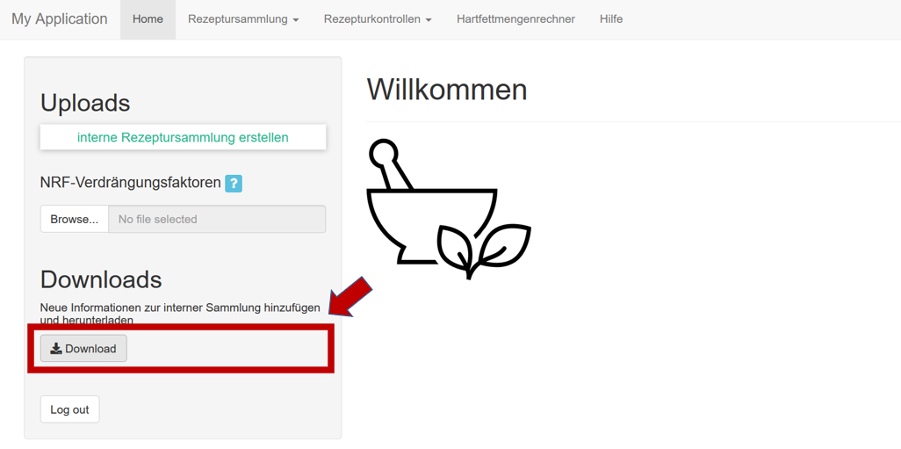
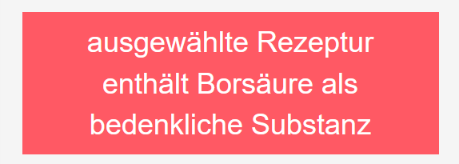

### Inhaltsverzeichnis
- [Eigenen Datensatz für Upload erstellen](#eigenen-datensatz-für-upload-erstellen)
- [Eigene Rezeptur hinzufügen](#eigene-rezeptur-hinzufügen)
- [Verdrängungsfaktoren hinzufügen](#verdrängungsfaktoren-hinzufügen)
- [Rezepturensuche](#rezepturensuche)
- [Rezepturencheck](#rezepturencheck)
  - [Ergebnisse der Rezepturkontrollen](#ergebnisse-der-rezepturkontrollen)

**********************************************************************

Es gibt 2 Möglichkeiten die App zu nutzen:
* ohne Upload
* mit Upload von eigenen Dateien

# Eigenen Datensatz für Upload erstellen

Man kann einen zip komprimierten Ordner mit eigenen Dateien hochladen.

Dieser Ordner muss 3 Dateien enthalten:
* Verdrängungsfaktoren
* Herstellungshinweise
* Rezepturzusammensetzung

Um einen solchen Ordner mit diesen Dateien ohne Inhalt zu erstellen, klicken Sie auf **interne Rezeptursammlung erstellen**.

Es erscheint ein Download-Bereich. Klicke auf **Download** und ein zip komprimierter Ordner wird heruntergeladen.  
Dieser Ordner mit den darin enthaltenden Dateien ist für den Upload und damit für das Hinzufügen von eigenen Rezepturen/Verdrängungsfaktoren geeignet. 

# Eigene Rezeptur hinzufügen

Um eigene Rezepturen abzuspeichern, erstellen Sie einen [eigenen Datensatz](#eigenen-datensatz-für-upload-erstellen) oder laden sie unter **interne Sammlung** Ihren Datensatz hoch.  
Es erscheinen unter Rezeptursammlung die Seiten **neue Rezeptur** und **neue Herstellungsanweisung**  

Unter **neue Rezeptur** kann die Zusammensetzung einer Rezeptur eingetragen werden.  
Man kann Substanzen aus der Arzneitaxe auswählen oder andere Substanzen eintragen.  
Mengenangaben können entweder in g oder ml angegeben werden.  
Wenn mit einer Substanz bis zu einer bestimmeten Menge aufgefüllt werden soll, drücke **ad** und gib dahinter die Gesamtmenge an. 

Diese Rezeptur muss unter **neue Herstellungshinweise** benannt werden (Titel).   
Es können weitere Informationen wie Herstellungshinweise, Dosierung, Haltbarkeiten, Quelle usw zur Rezeptur hinzugefügt werden. 
Durch klicken auf **Rezeptur hinzufügen** wird die Zusammensetzung der Rezeptur mit die dazugehörigen Informationen hinzugefügt. 

Kontrollieren Sie auf der Startseite die hinzugefügten Informationen und downloaden Sie den aktualisierten Datensatz.  
Dieser Ordner kann bei der nächsten Verwendung der App wieder hochgeladen werden. 

# Verdrängungsfaktoren hinzufügen

Wenn Sie einen Zugang zum online DAC/NRF-Werk 2022 haben, speichern Sie die DAC-Anlage F als PDF ab.

Die DAC-Anlage F kann als PDF hochgeladen werden, dadurch werden die Verdrängungsfaktoren eingelesen und zum eigenen Datensatz hinzugefügt

Wird beim Hartfettmengenrechner eine Substanz nicht gefunden, wählen Sie **Substanz nicht in Liste vorhanden**.  
Dadurch erscheint ein neues Fenster. 
Mit diesen Fenster können Sie neue Substanzen und deren Verdrängungsfaktoren zu Ihren Datensatz hinzufügen. Klicken Sie dabei auf **übernehmen**.  
Kontrollieren Sie die neuen Verdrängungsfaktoren auf der Startseite und downloaden Sie den neuen Datensatz. 

# Rezepturensuche
Rezepturen können in einer Rezepturensammlung gesucht werden. 

Diese Rezepturensammlung setzt sich zusammen aus:
* Rezepturen aus dem Kompendium JUNIORMED
* eigene hochgelade Rezepturen (optional)

Um Rezepturen in der Rezepturensammlung zu suchen, wählen Sie die Bestandteile der Rezeptur unter **Zusammensetzung der Rezeptur** aus. Auf der rechten Seite finden Sie die gefundenen Rezepturen. Um zusätzliche Informationen sehen zu können, klicken Sie die gewünschte Rezeptur an.  
Ist die ausgewählte Rezeptur eine JUNIORMED Rezeptur, dann öffnet sich ein neues Fenster mit der online Version des JUNIORMEDs. Dabei ist bereits die Seite mit der ausgewählten Rezeptur ersichtlich.  

Ist die ausgewählte Rezeptur eine selbst abgespeicherte Rezeptur, erscheint auf der rechten Seite eine Tabelle mit den abgespeicherten Informationen. 

# Rezepturencheck

Automatisch ausgeführte Prüfungen der ausgewählten Rezeptur sind:

* Erstattungsfähigkeit
* Rezeptpflichtstatus
* Kompatibilität der Substanzen mit Salbengrundlage
* Dosierung von lokal applizierten Wirkstoffe
* Bedenkliche Bestandteile 

wenn keine Rezeptur in der Sammlung gefunden wurde, und trotzdem die Rezepturchecks durchgeführt werden soll, geben Sie alle Bestandteile unter **Zusammensetzung der Rezeptur** ein und klicken Sie auf **Rezeptur wurde nicht gefunden**

## Ergebnisse der Rezepturkontrollen

Erscheinen auf der linken Seite, durch klicken darauf gelangt man zur entsprechenden Seite

* Erstattungsfähigkeit

| First Header  | Second Header |
| ------------- | ------------- |
|  | alle Bestandteile der Rezeptur erstattungsfähig  |
|  | Content Cell  |

|  | alle Bestandteile der Rezeptur erstattungsfähig |
|  | mindestens ein Bestandteil der Rezeptur befindet sich nicht in der grünen Box bzw. wurde in der Arzneitaxe nicht gefunden. |

* Rezeptpflichtstatus

 mindestens ein Bestandteil der Rezeptur ist in der Rezeptpflichtverordnung gelistet

* Kompatibilität der Substanzen mit Salbengrundlage

 alle Bestandteile der Rezeptur sind mit der Grundlage stabil  
 es kann nicht für alle Bestandteile eine eindeutige Entscheidung getroffen werden  
 mindestens ein Bestandteil der Rezeptur ist nicht kompatibel mit der Grundlage

* Dosierung von lokal applizierten Wirkstoffe

 Über mindestens ein Bestandteil sind Dosierungsinformationen vorhanden

* Bedenkliche Bestandteile 

 ausgewählte Substanz ist als bedenklich eingestuft  
 ausgewählte Rezeptur enthält mindestens eine bedenkliche Substanz

#### Erstattungscheck

Alle Bestandteile befinden sich in der grünen Box

Bei Bestandteile die sich nicht in der grünen Box befinden erscheint eine rote Meldung. 
Bei Bestandteile die in der Arzneitaxe nicht gefunden wurde erscheint eine gelbe Meldung.

#### Rezeptpflichtstatus

Sind Bestandteile der ausgewählten Rezeptur in der Rezeptpflichtverordnung gelistet erscheinen diese Bestandteile in einer Tabelle. 

### Kompatibilität der Substanzen mit Salbengrundlage

chemische und physikalische Stabilität der Substanzen mit Salbengrundlagen wird in Form von Tabellen dargestellt. 

### Dosierung von lokal applizierten Wirkstoffe

Die Konzentration der Arzneistoffe wird automatisch berechnet. Dabei muss die insgesamt herzustellende Menge und die Arzneistoffmenge angegeben werden. Befindet sich diese Konzentration außerhalb der therapeutisch üblichen Konzentration erscheint eine rote Meldung.  

### Bedenkliche Bestandteile 

Es kann unter **search** Substanzen gesucht werden.
Befindet sich in der ausgewählten Rezeptur eine bedenkliche Substanz wird diese automatisch in der Tabelle gesucht. 

### Hartfettmengenrechner

* ohne Upload

Die Hartfettmenge kann für Zäpfchen mit bis zu 3 Substanzen berechnet werden.

Wird die bewilligungsfreie Menge von 24 Zäpfchen überschritten, wird man darüber informiert. 

* mit Upload

Verdrängungsfaktoren können auf der Startseite entweder über **NRF-Verdrängungsfaktoren** oder **interne Sammlung** hochgeladen werden.

Nach Upload erscheint das Feld **Substanz**, dort kann die Substanz ausgewählt werden und die entsprechende Verdrängung wird für die Berechnung der Hartfettmenge berücksichtigt. 

wenn die gewünschte Substanz noch nicht abgespeichert wurde, wähle **Substanz nicht in Liste vorhanden** und füge fehlende Substanz hinzu.

